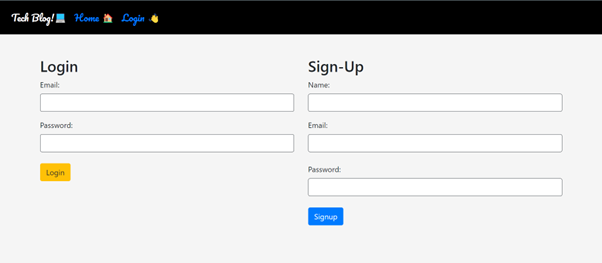
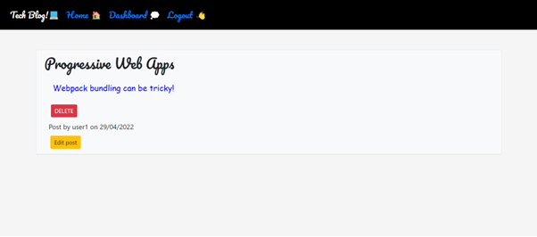
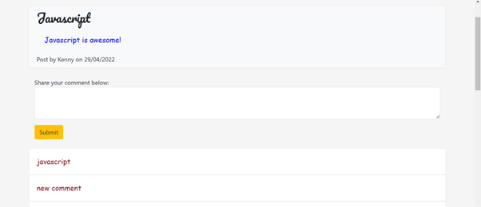

# MVC-Tech-Blog

## Table of Contents

- [Description](#description)
- [Installation](#installation)
- [Usage](#usage)
- [Example](#examples)
- [Contact Information](#contact)

## Description

This application is a CMS-style blog site similar to a Wordpress site, where developers can publish their blog posts and comment on other developers’ posts as well. The app follows the MVC paradigm in its architectural structure, using Handlebars.js as the templating language, Sequelize as the ORM, and the express-session npm package for authentication.

## Installation

- open a terminal 
- node.js needs to be installed prior to use
- clone the repo: `https://github.com/NAli3107/MVC-Tech-Blog`
- download npm JSON packages by entering `npm i or npm install`
- create a dotenv file
- enter `npm start` to start the server.js file which will then start API on `localhost PORT 8000`

## Usage

Users can access the deployed application on Heroku using the following link:

https://intense-tundra-02276.herokuapp.com/

## Examples

Screenshot of Deployed App:

## Contact

Email Address: Nadiraali188a@gmail.com

Linkedin Profile: [LinkedIn](https://www.linkedin.com/in/nadira-ali-09a182106/)

Github: [Profile](https://github.com/NAli3107)

Github: [Repo](https://github.com/NAli3107/MVC-Tech-Blog)
